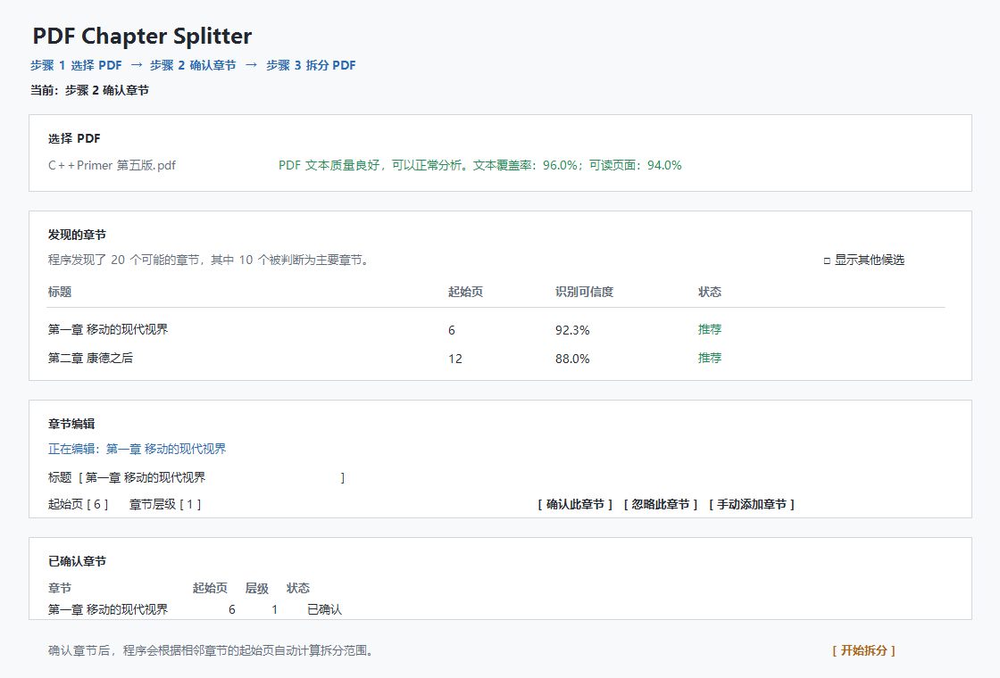

# PDF Chapter Splitter

PDF Chapter Splitter 是一个 Python 桌面工具，用来把一本 PDF 按章节拆成多个 PDF，并可选择打包成 ZIP。

它会先分析 PDF 中可能的章节起点，然后让你人工确认、修改或忽略这些章节。程序不会自动替你决定哪些一定是章节。



## 三步使用

| 步骤 | 操作 | 说明 |
| --- | --- | --- |
| 1. 选择 PDF | 点击“选择 PDF” | 程序读取页数、文本质量，并查找可能的章节。 |
| 2. 确认章节 | 检查“发现的章节” | 可以确认、修改、忽略，也可以手动添加章节。 |
| 3. 拆分 PDF | 选择输出目录后点击“开始拆分” | 程序会根据相邻章节的起始页自动计算拆分范围。 |

## 安装

项目要求 Python 3.12+。

```powershell
cd D:\PDF_Chapter_Splitter
python -m pip install -e ".[dev]"
```

## 启动

推荐双击项目根目录中的：

```text
启动软件.bat
```

也可以在 PowerShell 中运行：

```powershell
cd D:\PDF_Chapter_Splitter
.\.venv\Scripts\python.exe -m pdf_chapter_splitter.gui
```

## 支持什么 PDF

| PDF 类型 | 支持情况 |
| --- | --- |
| 有文本层的电子书 PDF | 支持自动发现章节候选。 |
| 带书签 / Outline 的 PDF | 支持读取书签并作为章节候选。 |
| 文本质量较低的 PDF | 可以分析，但需要更仔细人工检查。 |
| 扫描版 PDF | 当前不能 OCR；仍可手动添加章节。 |
| 加密 PDF | 当前不支持密码输入。 |

## 界面说明

| 区域 | 用途 |
| --- | --- |
| 步骤导航 | 显示当前处于“选择 PDF / 确认章节 / 拆分 PDF”的哪一步。 |
| PDF 文本质量 | 用普通语言提示这个 PDF 是否适合自动分析。 |
| 发现的章节 | 默认显示程序最推荐你检查的章节。 |
| 显示其他候选 | 展开低可信度、目录页疑似项或其他需要核对的候选。 |
| 章节编辑 | 修改标题、起始页、章节层级，并确认或忽略章节。 |
| 已确认章节 | 显示最终将用于拆分的章节起点，可修改或撤销确认。 |
| 为什么推荐这个章节？ | 默认折叠；展开后查看技术判断依据。 |

## 已知限制

| 限制 | 说明 |
| --- | --- |
| 不支持 OCR | 扫描版 PDF 需要手动添加章节。 |
| 不接入 AI | 当前没有 LLM、embedding 或语义识别。 |
| 没有 PDF 预览 | 目前不显示页面图像预览。 |
| 不自动确认章节 | 所有章节都需要用户明确确认。 |
| 不识别印刷页码 | 界面使用 PDF 物理页码，从 1 开始显示。 |
| 不支持取消任务 | 当前分析和拆分任务启动后不能中途取消。 |

## 命令行手动拆分

GUI 是推荐入口。也可以用命令行直接指定页码范围：

```powershell
pdf-chapter-splitter split book.pdf --segment "Part 1=1-50" --segment "Part 2=51-100" --zip
```

页码使用用户可见的 1-based 闭区间。例如 `1-50` 表示第 1 页到第 50 页。

## 开发

运行测试：

```powershell
.\.venv\Scripts\python.exe -m pytest -q
```

架构和 Phase 1～16 的开发历史已迁移到：

```text
docs/development-history.md
```

核心边界仍然保持：

```text
GUI
  ↓
WorkflowSession
  ↓
PDFChapterWorkflow
  ↓
PDF / chapters / splitter / archive
```

GUI 不直接调用 PDFReader、Detector、Fusion、ConfirmationService、BoundaryResolver、PDFSplitter 或 ZipCreator。
